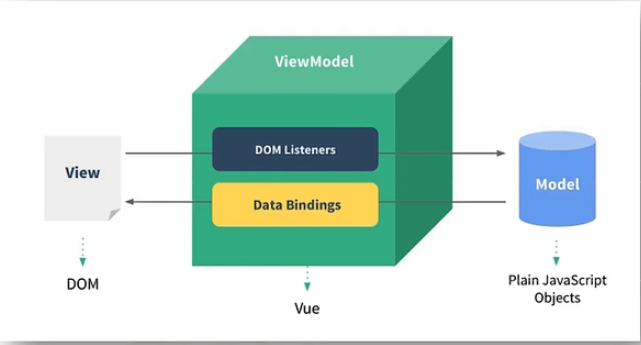

# Vue 笔记

### 简介

    用于构建用户界面的渐进式JavaScript框架

### 创造者

    尤雨溪

### 特点

    采用组件化模式，提高代码复用率，且让代码更好维护
    声明式编码，无需直接操作DOM，提高开发效率
    使用虚拟DOM和优秀的diffing算法，尽量复用DOM节点

### 初识 Vue

> - Vue.config.productionTip = false; 阻止 vue 启动时生成生产提示
> - 想让 Vue 工作，必须创建一个 Vue 实例，且要传入一个配置对象
> - root 容器里的代码依然符合 HTML 规范，混入了一些特殊的 Vue 语法
> - root 容器里的代码被称为 Vue 模板
> - Vue 实例和容器一一对应
> - 真实开发中只有一个 Vue 实例，且会配合组件一起使用
> - {{xxx}} 中 xxx 写 js 表达式，且 xxx 可以自动读取到 data 中的所有属性
> - 一旦 data 中的数据发生改变，那么页面中用到该数据的地方会自动更新

### 模板语法

理解

    Vue中包含了一些JS语法代码，语法分为两种：

1. 插值语法 (双大括号表达式)

   > 功能：用于解析标签体内容  
   > 写法：{{xxx}}，xxx 是 js 表达式，可直接读取到 data 中的所有属性

2. 指令 (以 v-开头)
   > 功能：用于解析标签 (包括：标签属性、标签体内容、绑定事件...)  
   > 例子：v-bind:href="xxx"

### 数据绑定

两种数据绑定方式：

1.  单向绑定(v-bind):

        数据只能从data流向页面

2.  双向绑定(v-model):

        数据不仅能从data流向页面，还可以从页面流向data

    备注：

        1. 双向绑定一般应用在表单类元素上
        2. v-model:value 可简写v-model，该指令只能用在输入类元素上

#### data 与 el 的两种写法

1.  el

        1.new Vue 时候配置el属性
        2.先创建Vue实例，随后再通过vm.$mount('#root')指定el的值

2.  data 1.对象式 2.函数式
    选择：组件 data 必须使用函数式，否则会报错
3.  使用原则：

        由Vue管理的函数，一定不能用箭头函数，否则this不再指向Vue实例

### 理解 MVVM

#### MVVM 模型

1.M：模型（Model）：对应 data 中的数据

2.V：视图（View）：模板

3.VM： 视图模型（ViewModel）：Vue 实例对象

### 数据代理

    通过一个对象代理对另一个对象中属性的操作（读/写）

#### Vue 中的数据代理

    通过 vm对象 来代理data对象中属性的操作（读/写）

#### Vue 中数据代理的好处

    更加方便的操作data中的数据

#### 基本原理

- 通过 Object.defineProperty()把 data 对象中所有属性添加到 vm 上
- 为每一个添加到 vm 上的属性，都指定一个 getter/setter
- 在 getter/setter 内部去操作(读/写)data 中对应的属性
